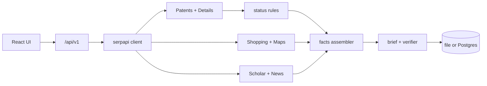

# Renaissance

**SerpApi India Hackathon 2026** · Track: **Commerce & Market Intelligence**

Renaissance turns patent search hits into **evidence-backed design dossiers**: legal status from Google Patents Details, market signals from Shopping and Maps, and optional cited brief copy—all tied to **SerpApi call receipts**. It is a research and product-intelligence tool, **not legal advice**.

---

## What you get

| Step | Output |
|------|--------|
| Search | Google Patents results (live or replay) |
| Open a dossier | Status verdict, term estimate, family members, legal timeline |
| Same scan | Shopping prices, Maps makers/suppliers, Scholar papers, News headlines |
| Brief | One-page design brief with a verifier that strips uncited numbers |

Status rules use retrieved `legal_status_cat`, family rows, timeline events, and a conservative 20-year term estimate—never “expired because filing date is old.”

---

## Try it in 2 minutes (no API key)

```bash
git clone https://github.com/AryanSaxenaa/renaissance.git
cd renaissance
npm ci
npm run dev
```

| URL | Role |
|-----|------|
| http://localhost:5173 | React UI (Vite) |
| http://localhost:3000/api/v1/health | API health |

**Replay mode** loads frozen SerpApi JSON from `fixtures/replay/` when `SERPAPI_API_KEY` is unset.

Suggested path for judges:

1. Open the app → accept the optional **Shepherd** tour (curated replay dossier).
2. Or go to **Search**, try `centrifugal governor`, open any result dossier.
3. Inspect **Status**, **Facts**, and **Evidence** (SerpApi metadata IDs).

---

## Live SerpApi

1. Copy [`.env.example`](.env.example) to `.env.local`.
2. Set at minimum:

```env
RENAISSANCE_MODE=live
SERPAPI_API_KEY=your_key
```

3. Restart `npm run dev`.

**Public demo** (e.g. Railway): set `PUBLIC_DEMO_MODE=true` and `ACCESS_CODE`; visitors enter the code on the search page. Credit caps (`DAILY_CREDIT_CAP`, `PER_BRIEF_CREDIT_CAP`, `SERPAPI_MONTHLY_HARD_CAP`) are enforced in the SerpApi client.

Optional **OpenRouter** (`OPENROUTER_API_KEY`) enables LLM-drafted briefs in live mode; replay uses a deterministic draft when no key is set.

---

## SerpApi engines (submission path)

All live calls go through **`src/server/serpapi/`** (cache, budget, ledger, replay/record modes).

| Engine | Used for |
|--------|----------|
| `google_patents` | Patent search |
| `google_patents_details` | Family, legal status, timeline |
| `google_shopping` | Market / price facts |
| `google_maps` | Local makers and suppliers |
| `google_scholar` | Literature |
| `google_news` | Recent coverage |

A full dossier scan typically uses **about 5 SerpApi credits** after search (details + four parallel market/literature calls), subject to cache hits and caps.

---

## Architecture



Legacy helpers under `src/server/renaissance/` remain from the pre-hackathon baseline; the hackathon demo path is **`/api/v1/*`** and the modules above.

---

## Environment reference

| Variable | Purpose |
|----------|---------|
| `RENAISSANCE_MODE` | `replay` (default without key), `live`, or `record` |
| `SERPAPI_API_KEY` | SerpApi authentication |
| `OPENROUTER_API_KEY` | Optional brief generation |
| `PUBLIC_DEMO_MODE` + `ACCESS_CODE` | Gate live public deployments |
| `RENAISSANCE_STORE` | `file` (default) or Postgres via `DATABASE_URL` |
| `DEFAULT_CITY` | Maps context (allowed city list in server) |

See [`.env.example`](.env.example) for the full list.

---

## Scripts

| Command | Description |
|---------|-------------|
| `npm run dev` | Vite + API with hot reload |
| `npm test` | Vitest (parsing, status rules, guards, bundle) |
| `npm run build` | Production client + server |
| `npm start` | Run `dist/server` after build |
| `npm run shepherd:export` | Refresh curated tour fixture pack |
| `npm run fixtures:freeze` | Record live responses into replay fixtures |

---

## Quality gates

- **No invented numbers** in briefs (verifier + tests).
- **Server logging** via `pino` (no stray `console.log` in server code).
- **CI**: GitHub Actions runs tests on push.

Run before you push:

```bash
npm test
npm run build
```

---

## Deployment

The repo includes a **Dockerfile** suitable for platforms like Railway: build the client, serve static assets from Express in production, API on the same host. Set production env vars in the host dashboard; use `trust proxy` when behind a reverse proxy.

---

## Hackathon disclosure

| Item | Detail |
|------|--------|
| Pre-hackathon baseline | Git tag [`pre-hackathon-baseline`](https://github.com/AryanSaxenaa/renaissance/releases/tag/pre-hackathon-baseline) |
| AI assistance | Used for implementation and documentation; declare on the official form as required |
| Live data | Subject to [SerpApi](https://serpapi.com/) account terms and credits |

---

## License

This project is licensed under the **[MIT License](LICENSE)**.

Third-party npm packages are listed in `package.json`. **Search results and patent data** are fetched via SerpApi under your API account; Renaissance does not redistribute SerpApi response data as a separate dataset.

---

## Disclaimer

Patent status and market facts are **informational** summaries of retrieved records. Always confirm freedom-to-operate and commercial decisions with qualified counsel and primary sources.
